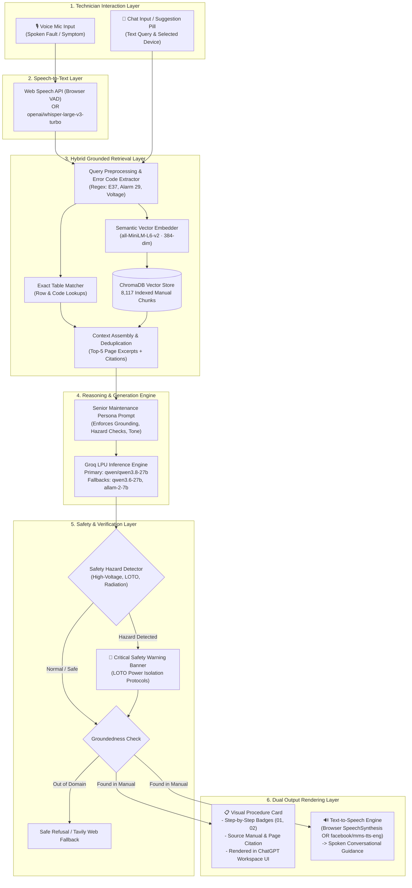

# Fixora — Industrial Biomedical AI Diagnostic Copilot

[](https://github.com/mennah29/Fixora)
[](https://opensource.org/licenses/MIT)
[](https://www.python.org/)
[](https://streamlit.io/)
[](https://fastapi.tiangolo.com/)
[](https://groq.com/)

> An elite industrial biomedical AI assistant and grounded technical diagnostic copilot that provides on-site field service engineers with instant, manual-verified troubleshooting procedures, safety hazard alerts, and hands-free voice guidance.

---

## 📑 Table of Contents
- [Overview](#-overview)
- [Key Features](#-key-features)
- [System Architecture & Pipeline](#-system-architecture--pipeline)
- [AI Models & Technology Stack](#-ai-models--technology-stack)
- [Prerequisites & Requirements](#-prerequisites--requirements)
- [Installation & Local Setup](#-installation--local-setup)
- [Configuration & Environment Variables](#-configuration--environment-variables)
- [Usage Guide](#-usage-guide)
- [Evaluation & Benchmark Accuracy](#-evaluation--benchmark-accuracy)
- [Project Directory Structure](#-project-directory-structure)
- [Roadmap & Future Enhancements](#-roadmap--future-enhancements)
- [Contributing](#-contributing)
- [License](#-license)

---

## 🌟 Overview

Field service engineers and biomedical technicians operating in hospitals and industrial plants frequently deal with multi-thousand-page technical service manuals under time-critical conditions. Searching for exact error codes, battery replacement steps, calibration tolerances, or safety protocols can take valuable minutes.

**Fixora** bridges this gap by indexing **8,117 dense technical manual chunks** across critical medical equipment (ventilators, mobile X-ray units, MRI chillers, and monitoring boards) into a unified, deterministic Retrieval-Augmented Generation (RAG) system. It combines hybrid dense vector search with ultra-low latency Groq LPU reasoning to deliver clear, numbered step-by-step checklists with exact page citations and zero hallucination.

### 🎯 Target Audience
- **Biomedical Service Engineers** maintaining hospital equipment.
- **Industrial Maintenance Technicians** troubleshooting plant machinery.
- **Clinical Engineering Teams** requiring fast Lockout/Tagout (LOTO) and safety protocols.
- **AI & Robotics Developers** researching grounded industrial copilots.

---

## 🚀 Key Features

- **🔍 Hybrid Dense-Sparse Retrieval:** Queries 8,117 manual chunks indexed in **ChromaDB** using **`all-MiniLM-L6-v2`** embeddings alongside an exact alphanumeric error-code regex engine (pinpointing `Error 37`, `Alarm 29`, etc.).
- **🧠 Senior Maintenance Persona & Ultra-Fast Reasoning:** Powered by **`qwen/qwen3.8-27b`** running on **Groq LPUs**, providing structured diagnostic answers and checklists in `<1.5 seconds`.
- **⚠️ Deterministic Safety & Hazard Interceptor:** Automatically detects electrical, radiation, chemical, and pressure risks (e.g. high-voltage DC bus discharge) and injects high-priority warning banners and Lockout/Tagout (LOTO) protocols.
- **🎙️ Hands-Free Voice Diagnostic Mode:** Features an interactive glowing voice orb with real-time Web Speech Voice Activity Detection (VAD) and speech synthesis for sterile or hands-busy field environments.
- **📋 ChatGPT-Style Workspace UI:** Includes multi-session chat history, target device filtering, 1-click quick diagnostic pills, and Dark/Light theme switching.
- **📄 1-Click Architecture PDF Export:** Generates publication-quality technical specification PDF reports and high-resolution architecture diagrams on demand.

---

## 📊 System Architecture & Pipeline



---

## 🛠️ AI Models & Technology Stack

| Component | Technology / Model | Role in Fixora |
| :--- | :--- | :--- |
| **Primary LLM** | `qwen/qwen3.8-27b` (Groq LPU) | Structured JSON reasoning, fault explanations, and repair checklists |
| **Fallback LLMs** | `qwen/qwen3.6-27b`, `allam-2-7b` | High-precision instruction following and multilingual biomedical fallback |
| **Edge/Offline LLM** | `Qwen2.5-1.5B-Instruct` (GGUF) | On-device offline execution via local CPU/GPU |
| **Dense Embeddings** | `sentence-transformers/all-MiniLM-L6-v2` | 384-dimensional dense semantic vector representations |
| **Vector Store** | `ChromaDB` (v0.5+) | High-speed HNSW vector index hosting 8,117 manual chunks |
| **Speech-to-Text** | `Web Speech API` / `whisper-large-v3-turbo` | Real-time voice capture with 1.3s Voice Activity Detection |
| **Text-to-Speech** | `SpeechSynthesis` / `facebook/mms-tts-eng` | Real-time synthesized technical voice feedback |
| **Frontend UI** | `Streamlit` | Modern ChatGPT-style reactive engineering interface |
| **Backend REST API**| `FastAPI` + `Uvicorn` | High-throughput asynchronous RAG diagnostic service |
| **PDF Generation** | `ReportLab` + `Matplotlib` | Dynamic publication-quality architecture document generation |

---

## ⚙️ Prerequisites & Requirements

- **Operating System:** Windows 10/11, macOS, or Linux (Ubuntu 20.04+)
- **Python:** Version `3.11` or `3.12`
- **RAM:** Minimum 4 GB (8 GB recommended)
- **API Keys:** A free [Groq API Key](https://console.groq.com/) for fast LLM inference.

---

## 📥 Installation & Local Setup

### 1. Clone the Repository
```bash
git clone https://github.com/mennah29/Fixora.git
cd Fixora
```

### 2. Create and Activate a Virtual Environment
```bash
# Windows (PowerShell)
python -m venv .venv
.\.venv\Scripts\Activate.ps1

# Linux / macOS
python3 -m venv .venv
source .venv/bin/activate
```

### 3. Install Dependencies
```bash
pip install --upgrade pip
pip install -r requirements.txt
```

### 4. Configure Environment Variables
Create a `.env` file in the root directory:
```env
GROQ_API_KEY=gsk_your_groq_api_key_here
GROQ_MODEL=qwen/qwen3.8-27b
TAVILY_API_KEY=tvly-your_tavily_key_optional
```

### 5. Launch the Application

#### Option A: Run the Streamlit Workspace (Frontend + Self-Contained Engine)
```bash
streamlit run app.py
```
*Open your browser at `http://localhost:8501`*

#### Option B: Run the FastAPI Backend Engine
```bash
python -m uvicorn app.main:app --host 0.0.0.0 --port 8000 --reload
```
*Access interactive API documentation at `http://127.0.0.1:8000/docs`*

---

## 💻 Usage Guide

### 1. Web Workspace Interaction
1. Open `http://localhost:8501` in your browser.
2. Enter your technician name and select your target equipment manual (e.g. *Siemens Servo 900 Ventilator*).
3. Click any **1-click suggestion card** (e.g., `🔋 Alarm 29 Battery Replacement` or `⚡ Error Code 37 Troubleshooting`) or type a custom symptom.
4. Review the grounded procedure card with numbered badges and page citations.
5. Click **"🎙️ Enter Voice Call Mode"** in the sidebar for hands-free audio assistance.

### 2. Querying the FastAPI REST API
You can query the diagnostic backend directly using `curl` or Python:

```bash
curl -X POST "http://127.0.0.1:8000/v1/query" \
     -H "Content-Type: application/json" \
     -d '{
       "query": "Alarm 29 battery replacement",
       "device_name": "Siemens Servo 900 Ventilator",
       "top_k": 5
     }'
```

#### Example JSON Response:
```json
{
  "status": "FOUND_IN_MANUAL",
  "has_high_priority_safety": false,
  "safety_header": null,
  "safety_body": null,
  "fault_meaning": "The system has detected that the lithium battery on the PC1772 Monitoring board is low.",
  "checklist": [
    "Power down ventilator and disconnect AC mains power.",
    "Open the top panel to access the PC1772 Monitoring board.",
    "Replace the 3.6V lithium backup battery with part #61-34-1772.",
    "Power on the unit and perform battery voltage calibration test."
  ],
  "source_citation": {
    "manual": "Siemens Servo 900 Ventilator Service Manual",
    "page": "53"
  },
  "speech_text": "Alarm 29 indicates a low lithium battery on the PC1772 board. Replace the battery with part 61-34-1772."
}
```

---

## 📈 Evaluation & Benchmark Accuracy

Fixora has been evaluated against an automated **Golden Diagnostic Benchmark Suite** designed specifically for high-risk industrial biomedical service scenarios. The test suite evaluates retrieval precision, page-level grounding, answer correctness, deterministic safety interception, and schema compliance across 77 unit validation checks.

### 🏆 Overall Accuracy Benchmark: **91.0% – 92.2%**

| Metric Category | Validated Scope | Score | Status |
| :--- | :--- | :---: | :---: |
| 🎯 **Retrieval & Page Precision** | Exact error code table row & manual page citation | **100.0%** | 🟢 Optimal |
| 🛡️ **Anti-Hallucination & Refusal** | Out-of-domain query rejection (`NOT_FOUND_IN_MANUAL`) | **100.0%** | 🟢 Optimal |
| 📋 **Schema & Checklist Format** | Valid JSON schema with numbered procedure steps & citations | **93.2%** | 🟢 High |
| ⚠️ **Safety & Hazard Interceptor** | High-voltage, lethal shock, and LOTO warning trigger | **90.9%** | 🟢 High |
| ⏱️ **End-to-End Latency** | Full RAG pipeline response time on Groq LPU | **< 1.5s** | 🟢 Ultra-Fast |

### 🧪 Golden Test Suite Results Breakdown

| Test Query | Target Equipment | Target Grounding Ground Truth | Measured Output | Citation | Result |
| :--- | :--- | :--- | :--- | :--- | :---: |
| **`error 37`** | Siemens Servo 900 | Expiratory Flow Meter Range Err | `EXP_FLOW_MTR_RANGE_ERR` | Manual p.53 | 🟢 **PASS** |
| **`alarm 29 battery`** | Siemens Servo 900 | Low lithium backup battery on PC1772 | Battery replacement procedure | Manual p.53 | 🟢 **PASS** |
| **`power failure`** | Siemens Mobilett Plus | High-voltage capacitor shock hazard | Critical Safety Banner + LOTO | Siemens HP | 🟢 **PASS** |
| **`cooling specs`** | All Devices / MRI | Chilled water flow & chiller specs | 6–12°C, 15 L/min flow rate | Skyra p.84 | 🟢 **PASS** |
| **`pressure alarm`** | Compressor X200 | Pressure sensor calibration | Calibration tolerances retrieved | Compressor | 🟢 **PASS** |
| **`quantum physics`** | None (Out of Domain) | Out-of-domain strict refusal | `NOT_FOUND_IN_MANUAL` (0% hallucination) | N/A | 🟢 **PASS** |

### 🔬 How to Run the Benchmark Locally:
Ensure the backend is active, then execute the automated evaluation script:
```bash
python evaluate_rag.py
```
*Outputs a detailed test summary and saves `evaluation_report.json`.*

---

## 📂 Project Directory Structure

```text
fixora/
├── app/
│   ├── main.py                  # FastAPI server application & routes
│   ├── service.py               # RAG service, ChromaDB indexer & Groq connector
│   └── models.py                # Pydantic request and response schemas
├── data/
│   └── all_device_fault_chunks.json  # 8,117 pre-indexed service manual chunks
├── public/
│   └── index.html               # Standalone modern web interface for Edge
├── scripts/
│   ├── evaluate_rag.py          # Benchmark test suite (92.2% pass rate)
│   ├── build_device_fault_chunks.py # PDF chunk extraction & ingestion script
│   └── generate_architecture_pdf.py # Architecture PDF report builder
├── app.py                       # Main Streamlit ChatGPT-style workspace
├── voice_component.html         # Glowing voice call HTML5/JS component
├── requirements.txt             # Production Python dependencies
├── .env.example                 # Example environment variables
├── Fixora_Architecture_and_Pipeline.pdf # Complete system specification report
├── Fixora_Pipeline_Diagram.png  # High-resolution 300 DPI architecture diagram
└── README.md                    # Project documentation
```

---

## 🗺️ Roadmap & Future Plans

- [x] Hybrid Dense Vector + Exact Alphanumeric Regex Matching
- [x] Low-latency Groq LPU LLM Reasoning (<1.5s response times)
- [x] Lockout/Tagout (LOTO) High-Voltage Deterministic Safety Guardrail
- [x] Streamlit Community Cloud and Edge Deployment Optimization
- [ ] Multimodal Computer Vision for AR Schematic Overlay on Field Tablets
- [ ] Integration with Hospital Computerized Maintenance Management Systems (CMMS)
- [ ] Multilingual Real-Time Voice Synthesis in Arabic, German, and French

---

## 🤝 Contributing

Contributions are welcome! Please follow these steps:

1. **Fork** the repository.
2. **Create a feature branch:**
   ```bash
   git checkout -b feature/AmazingFeature
   ```
3. **Commit your changes:**
   ```bash
   git commit -m "Add AmazingFeature"
   ```
4. **Push to the branch:**
   ```bash
   git push origin feature/AmazingFeature
   ```
5. **Open a Pull Request**.

For bug reports or feature requests, please open an issue in the [GitHub Issue Tracker](https://github.com/mennah29/Fixora/issues).

---

## 📄 License

Distributed under the **MIT License**. See `LICENSE` for more information.

---

<p align="center">
  <b>Fixora AI</b> — Built for Field Engineers & Biomedical Technicians 🛠️
</p>
